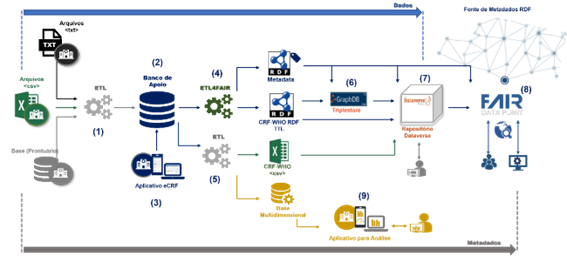

Plataforma VODAN BR
+++++++++++++++++++

A Plataforma VODAN BR foi projetada com o objetivo de prover uma infraestrutura escalável, distribuída e genérica que atenda um processo intensivo de coleta de dados com alta heterogeneidade, disponibilizando-os em plataformas que ofereçam dados e metadados interoperáveis e processáveis por agentes de software, que apoiem a descoberta de outros recursos que possam ser associados a eles [7]. 

Essa plataforma respeita as premissas que orientam as atividades relacionadas com a gestão de dados e seus metadados, e estabelece uma estrutura capaz de ser rapidamente ajustada, reduzindo esforços para mudanças em aplicações/ferramentas a cada evolução e versionamento do CRF da OMS ou dos instrumentos terminológicos de referência, no caso, o modelo de dados semântico COVIDCRFRAPID . Dentre as premissas estabelecidas merecem destaque [7]:

a)	criar uma infraestrutura capaz de implementar e disponibilizar um CRF digital (aplicativo), centrado nos usuários dos serviços de saúde, que seja capaz de atender aos episódios epidêmicos dessa pandemia;

b)	armazenar as informações estabelecidas no CRF-OMS, de forma anonimizada, considerando versionamento desse CRF;

c)	possibilitar a criação de CRFs nacionais ou a inclusão de questões adicionais específicas. Essa necessidade foi apresentada, tendo em vista os diferentes tipos de formulários de pesquisas empregados no Brasil, que, além dos elementos estabelecidos pelo CRF-OMS, adotam questões específicas, relevantes para pesquisas no País, como, por exemplo, participação em campanhas de vacinação e data da última dose;

d)	promover uma modelagem conceitual que permita o alinhamento dos elementos dos formulários às ontologias (modelos semânticos), auxiliando o processo de FAIRificação dos dados;

e)	prover uma infraestrutura flexível, modular, escalar e ágil, a fim de dar suporte a adaptações em softwares e bases de dados;

f)	transformar os dados coletados, isto é, “dados não FAIR” em dados interligados, mapeando-os para formatos legíveis por máquina, utilizando RDF, disponibilizando-os em datasets e publicando seus metadados, também em RDF, em um FAIR DP; e

g)	disponibilizar publicamente um FAIR DP configurado para atender as condições acordadas com os participantes, possibilitando acesso aos dados por meio de consultas controladas e não por tradicionais downloads.

A plataforma apresentada na Figura 2 foi concebida para tratar dados e serviços, desde a captação dos dados de pesquisa clínica pelas Unidades Hospitalares (UH) até a publicação de metadados no FAIR DP. Ela foi estruturada para ser modular, com atividades organizadas na forma de módulos que interagem de modo encadeado, ou seja, com o resultado de um módulo sendo a entrada do módulo subsequente. É escalável e distribuída, considerando que um banco de dados de apoio pode ser disponibilizado em cada UH, assim como o repositório de dados e/ou banco do tipo triplestore. Dessa forma, à medida que outros hospitais passem a participar do projeto, mais infraestrutura computacional será adicionada, fazendo com que ocorra um natural escalonamento horizontal. Além disso, a plataforma é flexível, pois os dados heterogêneos produzidos pelas UHs são tratados e transformados para uma representação em grafo RDF , um formato que facilita a interligação de dados.

Figura 2 - Plataforma de Geração de (Meta)Dados FAIR

Os dados e metadados seguem um fluxo da esquerda para direita como apresentado na figura 2. A captação dos dados pode ocorrer de diferentes formas, ou seja, por um processo ETL que trata arquivos no formato CSV, texto ou outro disponibilizado pelo hospital, por um processo ETL que acessa a base de dados do hospital, ou por um aplicativo eCRF (3) desenvolvido para permitir a entrada das informações por meio de uma interface gráfica com o usuário. O processo ETL inicial (1) coleta e realiza o tratamento necessário para transformar dados de prontuário (estruturados ou não) para um formato de pesquisa clínica, contemplando perguntas e respostas. Os dados processados no formato adequado são armazenados no banco de apoio (2). O processo ETL4FAIR (4) é responsável por gerar os dados e metadados em RDF. Opcionalmente, a critério dos hospitais, um processo ETL (5) poderá ser realizado para a geração dos dados de pesquisa no formato CSV. Além disso, esse processo poderá alimentar uma base multidimensional para a visualização dos dados empregando aplicativos para análise (9) como, por exemplo, o PowerBI . Os datasets com dados e metadados em RDF podem ser carregados/publicados em uma triplestore (6) como, por exemplo, o GraphDB , onde poderão ser acessados por consultas SPARQL . Esses mesmos datasets podem ser carregados para download em um repositório de dados (7) como, por exemplo, o Dataverse. Os esquemas de metadados referentes ao conjunto de dados (dataset e distribuição) devem ser publicados no FAIR DP (8).

Para que a plataforma cumpra com seu papel, mecanismos como os processos de ETL estão sendo implementados. A tabela 3 apresenta um resumo das atividades referentes aos processos e elementos da plataforma VODAN BR.

**(1)	Extração, transformação e carga (ETL) de dados de UH para o banco de apoio do VODAN BR**	

●	Desenvolvimento de um processo automatizado para o tratamento dos dados estruturados e não estruturados de pacientes com COVID-19. Essa atividade faz parte de um TCC e encontra-se em andamento.

**(2)	Banco de apoio com dados estruturados**

●	Modelagem de uma base de dados de apoio, para coleta de dados estruturados aderentes ao questionário da OMS. Modelo lógico construído e disponibilizado, usando a ferramenta Visual Paradigma.

●	Elaboração de dicionário de dados referente ao banco de apoio.

●	Criação de script para a base, em MySQL, com a carga inicial das tabelas básicas referentes ao questionário da OMS.

●	Evolução da base de dados inicial para comportar o versionamento de formulários e a gestão de novas pesquisas. Esta atividade faz parte de um TCC e encontra-se em andamento.

**(3)	Aplicativo eCRF**	

●	Módulo para criação de usuários e registro de informações dos pacientes COVID-19, de acordo com o questionário da OMS.

●	Em andamento: Extensão do aplicativo, dotando-o de um módulo para apoio à pesquisa. Esse módulo tem o propósito de permitir a criação e o versionamento de questionários de pesquisas. Essa atividade faz parte de um TCC e encontra-se em andamento. 

●	Em virtude de ajustes no banco para acomodar o novo módulo, o aplicativo será evoluído permitindo ao usuário selecionar a pesquisa que deseje trabalhar.

**(4)	ETL dos dados e metadados triplificados (RDF)**	

●	Implementação do processo de transformação de dados estruturados em (meta)dados FAIR, empregando o modelo semântico COVIDCRFRAPID: Versão 1.0 Prontificada.

●	Desenvolvimento do ETL4LOD+ Extension, agregando ao framework ETL4FAIR plugins para a carga de dados no GraphDB e dos metadados em um FAIR DP.

**(5)	ETL para visualização de dados**

●	Implementação de um processo de transformação de dados do questionário da OMS para um modelo que permita a visualização de informações, a partir dos dados estruturados em formulários de pesquisa. 

**(6)	Triplestore (GraphDB)**

●	Instalação, configuração e gerenciamento da triplestore para os dados de saúde.  

**(7)	Repositório Dataverse**

●	Instalação, configuração e gerenciamento do repositório de dados e metadados de proveniência do VODAN BR. 

**(8)	FAIR DP VODAN BR**

●	Instalação, configuração e gerenciamento do FAIR DP do VODAN BR.

●	Implementação e teste de um FAIR DP para nuvem. 

**(9)	Aplicativo de visualização de informações**

●	Elaboração do modelo de um Datamart para armazenamento dos dados. 

●	Implementação do Datamart.

●	Implementação de Painéis, empregando ferramentas como Power BI, para visualização de informações associadas ao Datamart.

