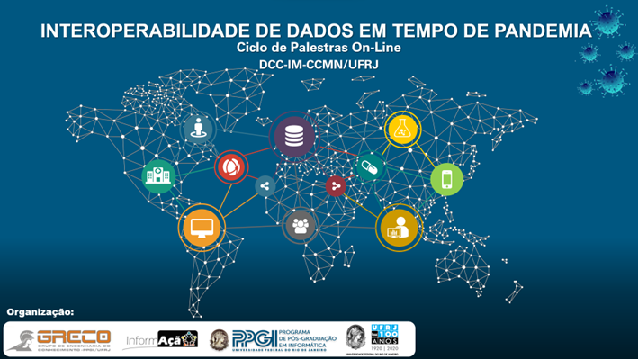

Participações em Eventos
========================

Posters em Eventos Internacionais
---------------------------------

#. `RDA’s 16th Virtual Plenary Meeting <https://vodanbr.github.io/presentations/2020/11/25/16-RDA-Plenary/>`_
  Período: 09 a 12 de novembro de 2020.
  Participação: Poster (melhor poster ).

#. `International FAIR Convergence Symposium <https://doi.org/10.5281/zenodo.4679001>`_ 
  Período: 22 a 23 de outubro de 2020.
  Participação: Poster sobre o Projeto .

Festivais, Seminários e Conferências
------------------------------------
    A tabela a seguir relaciona os eventos de 2020 com as respectivas divulgações do projeto.

.. list-table:: Dissertações e TCC associados ao Projeto VODAN BR
   :widths: 30 30 60
   :header-rows: 1

   * - Evento
     - Período
     - Participação
   * - Festival do Conhecimento UFRJ
     - 14 a 24 de julho de 2020.
     - Painel Temático: COVID-19 e a Rede VODAN Internacional
   * - Seminário Internacional sobre Gestão de Dados GO FAIR Brasil Saúde
     - 19 de julho de 2020.
     - Apresentação: Projeto VODAN Brasil – Rede de Dados de pesquisa para o enfrentamento da COVID-19
   * - 11ª Conferência Luso-brasileira de Ciência Aberta. 
     - 06 a 08 de outubro de 2020
     - Apresentação: VODAN BR – rede de dados de surto de covid-19 no brasil: a gestão de dados no enfrentamento de pandemias
   * - II Congresso Internacional em Humanidades Digitais - HDRio20/21
     - 12 a 16 abril de 2021. 
     - Apresentação: A GESTÃO DE DADOS NO ENFRENTAMENTO DE PANDEMIAS: a experiência Virus Outbreak Data Network
   * - FAIR Festival 2021
     - 21 a 23 de Junho
     - Apresentação: Learning to be FAIR during the COVID-19 pandemic: The VODAN BR Project 
   * - SBI AGRO 2021
     - 10 a 12 de novembro de 2021.
     - Participação em Painel
   * - Metadata and Semantics Research Conference (MTSR 2021)
     - 29 de novembro a 03 de dezembro de 2021.
     - Apresentação de Artigo: A Practical Approach of Actions for FAIRification Workflows [6]
   * - XLII Jornada Giulio Massarani de Iniciação Científica, Tecnológica, Artística e Cultural (JICTAC 2020 - Edição Especial) 
     - 22 a 26 de março de 2021.
     - Rede VODAN BR de dados de pesquisa em COVID-19: transformação de dados e metadados para FAIR Data Points
   * - Semana de Integração Acadêmica (SIAC 2021)
     - 14 a 18 de Fevereiro de 2022. 
     - Estudo da Plataforma CEDAR para Geração Automatizada de Metadados
   * - Semana de Integração Acadêmica (SIAC 2021)
     - 14 a 18 de Fevereiro de 2022. 
     - CRF4FAIR – Aplicativo para Gestão de Pesquisas Clínicas para o VODAN BR
   * - Semana de Integração Acadêmica (SIAC 2021)
     - 14 a 18 de Fevereiro de 2022. 
     - VODAN BR e ETL4LOD: Enriquecimento Semântico de dados de pacientes COVID-19.
   * - 24th International Conference on Enterprise Information Systems (ICEIS 2022)
     - 25 a 27 de abril de 2022.
     - Apresentação de Artigo: A Platform to Generate FAIR Data for COVID-19 Clinical Research in Brazil
   * - Festival do Conhecimento UFRJ 2022
     - 02 de Setembro
     - Painel Temático: FAIR para Pesquisa em Dados Clínicos da Saúde - Uma aplicação VODAN BR.

Tutoriais, Workshops e Apresentações Promovidos
-----------------------------------------------

#. Evento: Ciclo de Palestras On-Line: Interoperabilidade de dados em tempo de epidemia.

 
Figura 3 – Divulgação Ciclo de Palestras on Line - 2020.

**Palestras do Ciclo:**

* 1. Interoperabilidade de dados e redes de repositórios: aplicação no enfrentamento de pandemias virais

* 2. Movimento GO FAIR, princípios FAIR e tecnologias de apoio

* 3. Projeto do banco de dados de apoio ao prontuário de casos COVID-19 da OMS

* 4. Projeto de aplicativo para entrada de dados dos casos 

* 5. O papel de ontologias na anotação e interligação de dados sobre COVID-19

* 6. Processo de Transformação para Dados Interconectados

* 7. Rastreabilidade e gestão de proveniência

* 8. GraphDB como BD de triplas RDF no armazenamento e visualização de dados

* 9. Repositórios de Dados e FAIR Data Points 

* 10. Solução de BI para exploração dos casos COVID-19  

.. list-table:: Outros Eventos:
   :widths: 50 25
   :header-rows: 1

   * - Evento
     - Data
   * - Tutorial ETL4LOD+ 
     - Junho de 2020
   * - Reunião GO FAIR Saúde – Divulgação do Projeto VODAN BR
     - 15 de outubro de 2020
   * - SITREP das Atividades do Projeto
     - 25 de janeiro de 2021 
   * - SITREP das Atividades do Projeto
     - 30 de abril de 2021
   * - Tutorial CEDAR 
     - 24 de agosto de 2021
   * - Workshop de Sistemas de Informação em Saúde, Plataforma de Ciência de Dados Aplicada à Saúde e FAIR Data Point
     - 19 de outubro de 2021

